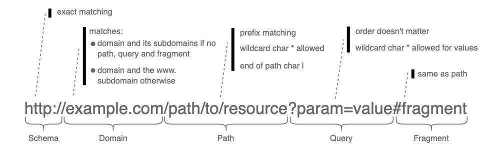

.. _`intro`:

============
Introduction
============

Let's start with an example. Imagine that you have several proxy servers and
you want to route requests to the right one. You could define the following rules:

* ``site1.com`` →︎ ``us_proxy``
* ``site2.com/uk`` →︎ ``uk_proxy``
* ``site2.com/ie`` →︎ ``ie_proxy``

All URLs from ``site1.com`` should use the US proxy. The situation for ``site2.com`` URLs are
different: if the path starts with ``/uk``, then the UK proxy should be used
whereas if the path starts with ``/ie`` then the IE proxy should be used instead.
This library allows to create a matcher that can be used to match URLs with the right proxy
using these rules.

Let see how the library can handle this situation:

.. code-block:: python

    from url_matcher import URLMatcher, Patterns

    matcher = URLMatcher()
    matcher.add_or_update("us_proxy", Patterns(["site1.com"]))
    matcher.add_or_update("uk_proxy", Patterns(["site2.com/uk"]))
    matcher.add_or_update("ie_proxy", Patterns(["site2.com/ie"]))

    proxy = matcher.match("http://site1.com/articles/article1")
    # proxy is "us_proxy" here

    proxy = matcher.match("http://site2.com/uk/a_page")
    # proxy is "uk_proxy" here

    proxy = matcher.match("https://www.site2.com/ie/a_page")
    # proxy is "ie_proxy" here

    proxy = matcher.match("http://example.com/a_differnt_page")
    # proxy is None here

As can be seen the the class :class:`url_matcher.URLMatcher` is handy to handle
this use case.

.. note::
    Relative URLs are not supported in the ``match`` method.

Patterns, include and exclude
=============================

A pattern is a URL that describes a set of URLs. For example, the
pattern ``example.com`` describes any URL whose domain is ``example.com``
or any of its subdomains.

A single patter is sometimes not enough to describe which URLs to match.
This is why we can define instead a set of patterns that are matched against.
There is then a list of positive patterns (``include``) and a list of
negative ones (``exclude``).

**A URL is a match** if it matches **at least one** of the patterns in ``include`` and
**none** of the patterns in ``exclude``.

This is an example of a rule using such a set of patterns:

.. code-block:: python

    patterns = Patterns(include=["example.com", "example.org"],
                        exclude=["*.jpg|", "*.jpeg|"])
    matcher.add_or_update("proxy_1", patterns))

Patterns
========

A pattern is a URL that describes a set of URLs. It itself is just a
URL. The following diagram summarizes its different parts and
what do they mean.

.. note::
    Matching is always **case-insensitive**.

The best way to understand how the patterns work is to look at some examples:

Basic patterns
--------------

.. csv-table::
   :file: patterns/basic_patterns.csv
   :widths: 30, 70
   :header-rows: 1

Domain patterns
---------------

.. csv-table::
   :file: patterns/domain_patterns.csv
   :widths: 30, 70
   :header-rows: 1

.. note::

    Rules above only differ by the ``/`` character and this
    is enough to change the matching behaviour. The
    general rule is that the pattern matches the domain or any
    of the subdomains only if the pattern does not contain a
    path, a query or a fragment. Otherwise, only URLs with the exact
    same domain after removing ``www.`` will match the pattern.

Path patterns
-------------

A URL matches if the pattern path is a prefix of it.

Besides, the following modifier characters can be used:

    * The ``*`` character matches any number of characters.
    * Use the ``|`` character at the end of the pattern path if
      a exact path matching is required.

.. csv-table::
   :file: patterns/path_patterns.csv
   :widths: 30, 70
   :header-rows: 1

Query patterns
--------------

It serves to match URLs that have some specific parameters in the URL.
The order of parameters in the query string is irrelevant.
The wildcard char ``*`` can be used for values.

If a parameter is repeated in the pattern it will match if any
of the values provided is matched

.. csv-table::
   :file: patterns/query_patterns.csv
   :widths: 30, 70
   :header-rows: 1

Fragment patterns
-----------------

It works exactly like the path.

Rules conflict resolution
=========================

Sometimes several rules can match the same URL. We have then a conflict.
By default the library
will prioritize the most specific rule. For example, if
a URL is matching both a rule with a pattern ``example.com`` and another
with the pattern ``example.com/articles`` then the later one will
be final match because it is more specific.

Alternatively, it is possible to control manually the order of rules
by using the ``priority`` parameter of the :class:`url_matcher.Patterns`.
In case of conflict, the rule with the highest priority will be chosen.

The full criteria applied to resolve a conflict between rules are:

  1. universality (rules with non universal include patterns are prioritized over rules with universal ones)
  2. priority (the highest wins)
  3. specificity (the most specific include patterns for the concerning domain wins)
  4. the rule id (the rule with the highest id wins)

Efficiency
==========

Internally, the library clusters the rules by the top level domain
of their include patterns. This is done to speed up the matching because
it reduces the space of possible rules that can match a URL.

The drawback is that the rules with ``include`` patterns that do not
belong to any top level domain are not supported. In fact, an
error is raised.

An exception were done for the universal matching pattern. It is
the only cross-top-level-domain ``include`` pattern that is allowed.
The rationale is that is can be convenient to define defaults (e.g.
to define the default proxy to use if no other rule matches).
